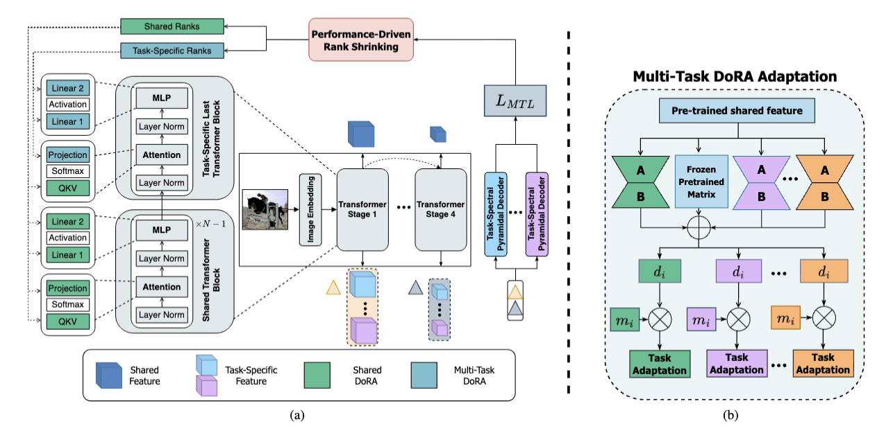

<div align="center">

<!-- Banner / Hero image -->


# FAAR: Efficient Frequency-Aware Multi-Task Fine-Tuning via Automatic Rank Selection - CVPR 2026 

<!-- Badges (edit as needed) -->
<p>
  <a href="https://github.com/Klodivio355/FAAR/stargazers"></a>
  <a href="https://github.com/Klodivio355/FAAR/network/members"></a>
  <a href="https://github.com/Klodivio355/FAAR/issues"></a>
  <a href="https://github.com/Klodivio355/FAAR/blob/main/LICENSE"></a>
</p>

</div>

# FAAR: Efficient Frequency-Aware Multi-Task Fine-Tuning via Automatic Rank Selection

## Introduction

This is the official implementation of the paper: **FAAR: Efficient Frequency-Aware Multi-Task Fine-Tuning via Automatic Rank Selection**.

This repository expends on baseline python codebase [MTLoRA](https://github.com/scale-lab/mtlora). We provide our own implementations of our MTL tuner (PDRS) versions [`(DoRA Version)`](models/lora7.py) and [`(LoRA Version)`](models/lora8.py) as well as our decoder plug-in module [`TS-PD`](models/seg_hrnet.py).


## How to Run

Running FAAR code is very similar to our MTLoRA baseline:

1. **Clone the repository**
    ```bash
    git clone https://github.com/Klodivio355/FAAR.git
    cd FAAR
    ```

2. **Install the prerequisites**
    - Install `PyTorch>=1.12.0` and `torchvision>=0.13.0` with `CUDA>=11.6`
    - Install dependencies: `pip install -r requirements.txt`

3. **Run the Fine-Tuning**
    ```python
    python -m torch.distributed.launch --nproc_per_node 1 --master_port 12345 main.py --cfg configs/swin/[swin_config].yaml --pascal <path to pascal database> --tasks semseg,normals,sal,human_parts --batch-size 32 --ckpt-freq=20 --epoch=300 --resume-backbone <path to the weights of the chosen Swin variant>
    ```
    Swin variants and their weights can be found at the official [Swin Transformer repository](https://github.com/microsoft/Swin-Transformer).

    The path arguments `--pascal` can be swapped for `--nyud`.
  
    The outputs will be saved in `output/` folder unless overridden by the argument `--output`.


## Citation
To cite FAAR, please use the following citation:
```
@misc{fontana2026faarefficientfrequencyawaremultitask,
      title={FAAR: Efficient Frequency-Aware Multi-Task Fine-Tuning via Automatic Rank Selection}, 
      author={Maxime Fontana and Michael Spratling and Miaojing Shi},
      year={2026},
      eprint={2603.20403},
      archivePrefix={arXiv},
      primaryClass={cs.CV},
      url={https://arxiv.org/abs/2603.20403}, 
}
```

## License
MIT License. See [LICENSE](LICENSE) file
